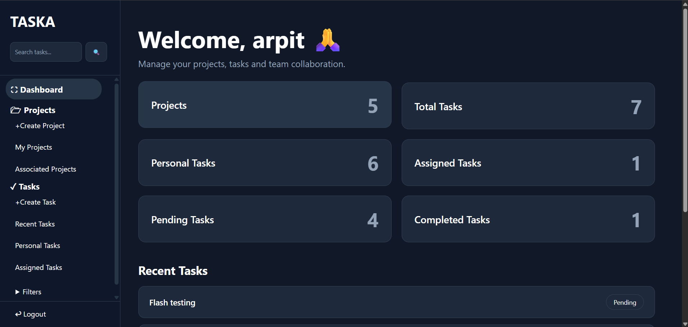
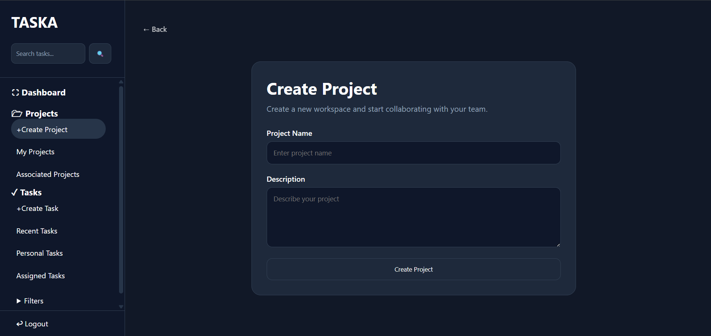
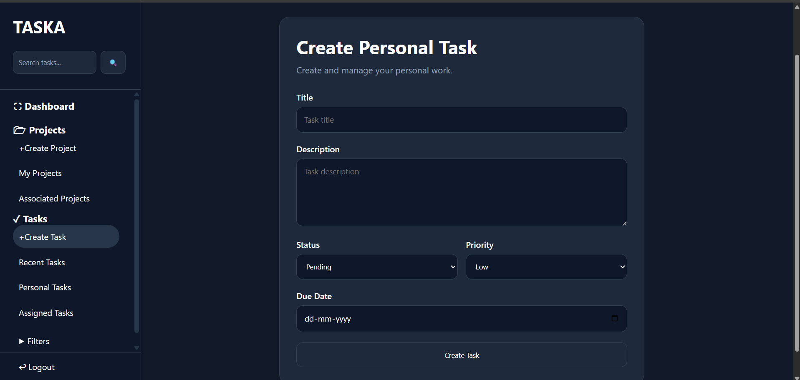
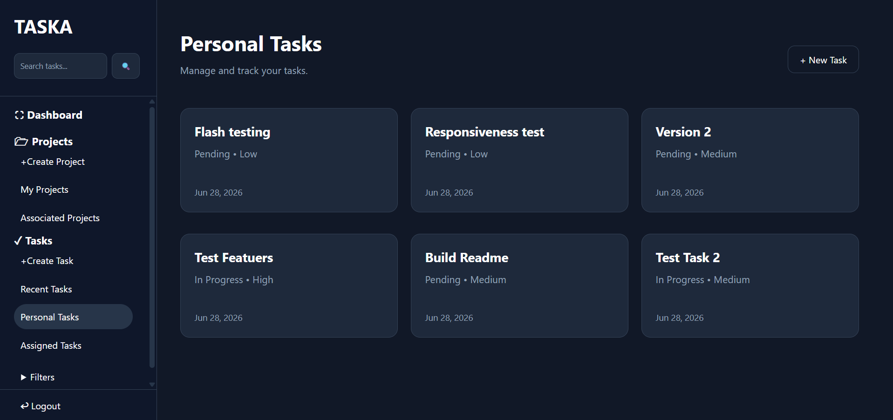
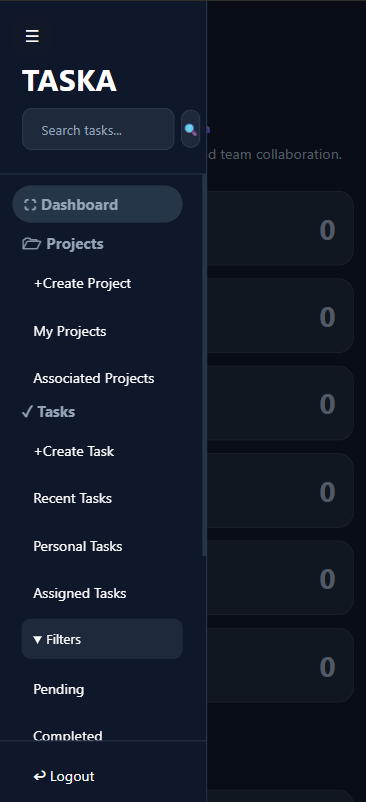
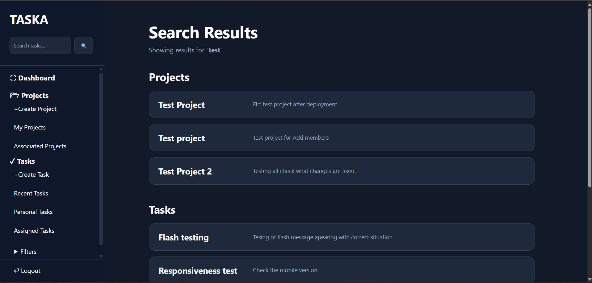

# 🚀 TASKA

A modern task and project management web application built with Flask. TASKA helps users organize personal tasks, collaborate on projects, assign work to team members, and track progress through a clean, responsive interface.

[🌐 Live Demo] [⭐ Star] [🐍 Python] [⚡ Flask] [🗄 SQLite] [☁️ Render]

🌐 **Live Demo:** https://taska-r202.onrender.com

---
## 🌟 Highlights

- 🔐 Secure user authentication
- 📁 Personal & collaborative project management
- ✅ Task assignment and tracking
- 📊 Interactive dashboard
- 📱 Fully responsive design
- ☁️ Deployed on Render

## ✨ Features

### 🔐 Authentication
- User Registration
- Secure Login & Logout
- Password Hashing
- Session Management

### 📁 Project Management
- Create Projects
- Edit Projects
- Delete Projects
- View Personal Projects
- View Associated Projects

### ✅ Task Management
- Create Personal Tasks
- Create Project Tasks
- Update Tasks
- Delete Tasks
- Assign Tasks to Team Members
- Priority Levels (Low, Medium, High)
- Status Tracking
- Due Dates

### 🔍 Search & Filter
- Search Tasks
- Search Projects
- Filter by Status
- Filter by Priority

### 📊 Dashboard
- Total Projects
- Total Tasks
- Personal Tasks
- Assigned Tasks
- Pending Tasks
- Completed Tasks
- Recent Tasks

### 🎨 User Experience
- Responsive Design
- Mobile-Friendly Sidebar
- Flash Messages
- Delete Confirmation Modal
- Custom 404 & 500 Error Pages
- Automatic Redirect Handling

---

## 🛠 Tech Stack

- Python
- Flask
- SQLite
- HTML5
- CSS3
- Jinja2
- Gunicorn
- Render

---

## 📁 Project Structure

```
TASKA/
│
├── models/
├── routes/
├── static/
├── templates/
├── utils/
│
├── app.py
├── init_db.py
├── requirements.txt
└── README.md
```

---

## 🚀 Installation

Clone the repository

```bash
git clone https://github.com/mishraadarsh17/TASKA.git
```

Move into the project

```bash
cd TASKA
```

Create a virtual environment

```bash
python -m venv taskenv
```

Activate it

### Windows

```bash
taskenv\Scripts\activate
```

### Linux / macOS

```bash
source taskenv/bin/activate
```

Install dependencies

```bash
pip install -r requirements.txt
```

Create a `.env` file

```
SECRET_KEY=your_secret_key
```

Initialize the database

```bash
python init_db.py
```

Run the application

```bash
python app.py
```

Open:

```
http://127.0.0.1:5000
```

---

## 📷 Screenshots

### Dashboard



### Projects



### Create-Tasks



### Tasks



### Mobile View



### Search View


---

## 🔮 Future Improvements

- PostgreSQL Support
- Email Notifications
- Comments on Tasks
- File Attachments
- Activity Timeline
- REST API
- Docker Support
- Unit Testing

---

## 👨‍💻 Author

**Adarsh Mishra**

GitHub: https://github.com/mishraadarsh17

---

## ⭐ If you like this project

Give it a ⭐ on GitHub!